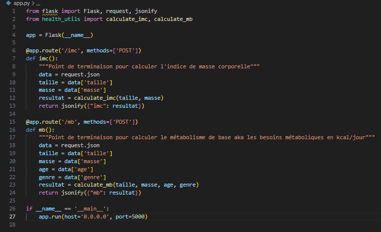
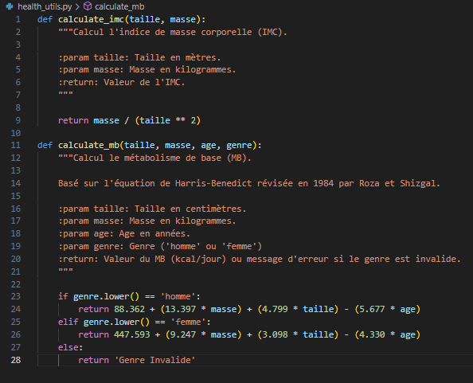
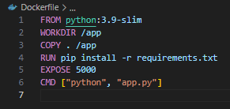
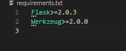
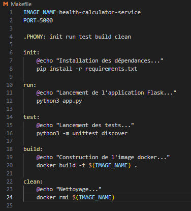
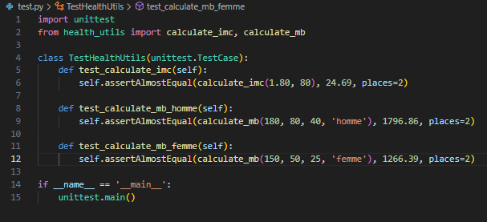
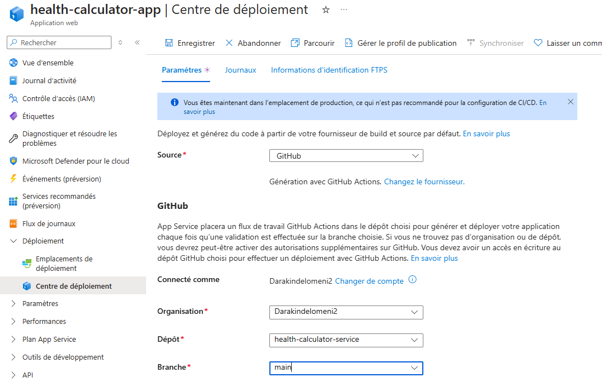
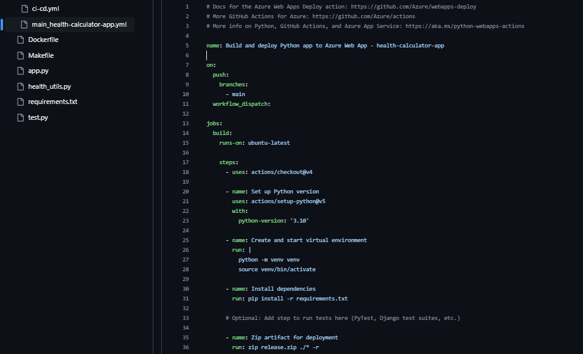

# **Déploiement d'une application web avec pipeline CI/CD vers Azure**
Déploiement d'une application python/flask pour calculer l'indice de masse corporelle (IMC/BMI) et le métabolisme de base (MB/BMR)

## **Pré-requis**
Avant de démarrer, assurez-vous de disposer des éléments suivants :

- Docker, python 3.9 ou + et make installés sur votre système.
- Git pour cloner le dépôt du projet.
- Un éditeur de texte pour modifier les fichiers de configuration si nécessaire. (vi, nano, etc)

Vous trouverez les informations concernant Docker [ici](https://www.docker.com/)., et les instructions pour l'installer [ici](https://docs.docker.com/).

## **Installation**
Utilisez git pour cloner le dépôt

`bash`
```bash
git clone <url_du_depot>
```

## **Etapes de construction**
Génération du fichier app.py avec les points de terminaisons pour /imc et /mb  
  

Génération du fichier health-utils.py contenant les fonctions utilisées calculate_imc et calculate_mb  
  

Génération du Dockerfile 
  

Génération du fichier requirements.txt pour spécifier la version de Flask et de ses dépendances  
  

Génération du fichier makefile
  

Génération du fichier test.py
  

Test de fonctionnement de la fonction calculate_imc en local  
  

Test de fonctionnement de la fonction calculate_mb en local  
  

Test de la commande make init  
  

Test de la commande make run  
  

Test de la commande make test  
  

Test de la commande make build  
  

Vérification des fichiers avec git status  
  

Mise en place du commit avec les commandes git add . et git commit -m "Commit initial"
  

Définition du git comme remote origin et push des fichiers  
  

Configuration de la machine sur Azure  
  

Configuration du déploiement via github  
  

Azure génère ensuite automatiquement le fichier yml pour la remontée  
  

Afin de faire fonctionner notre propre ci-cd.yml on récupère le profil de publication sur Azure  
  

On ajoute le profil de publication dans les secrets et variables de notre repository github  
  

On modifie la ligne correspondante de notre ci-cd.yml pour qu'elle corresponde au secret généré  
  

## **Test de l'application sur Azure**
Test de la fonction calculate_imc  
  

Test de la fonction calculate_mb pour un homme  
  

Test de la fonction calculate_mb pour une femme  
  